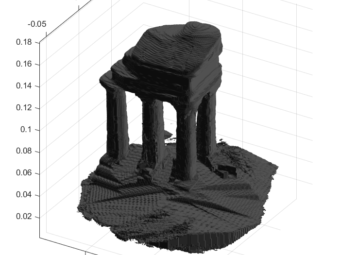

# Visual Hull Matlab

Visual Hull extraction from calibrate images using Matlab.
---
## Example Temple Sparse Rings

---
## Datasets

https://vision.middlebury.edu/mview/data/

---

More details can be found at http://vision.gel.ulaval.ca/~visualhull/
