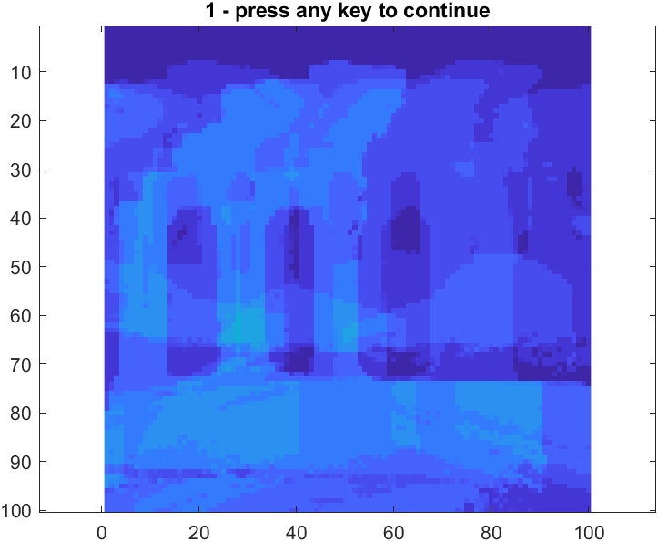
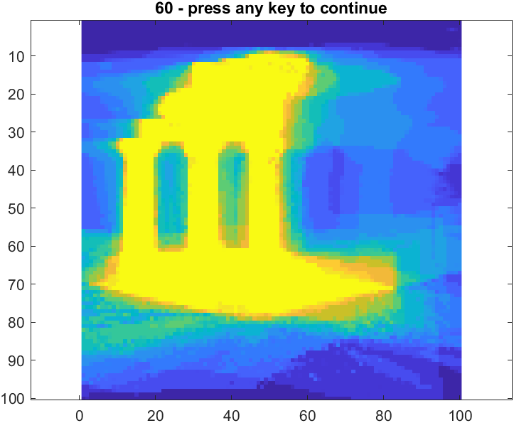
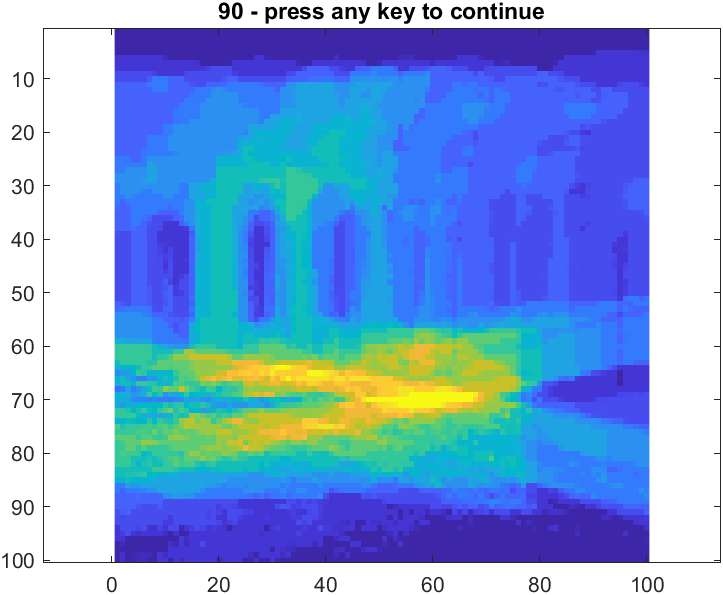
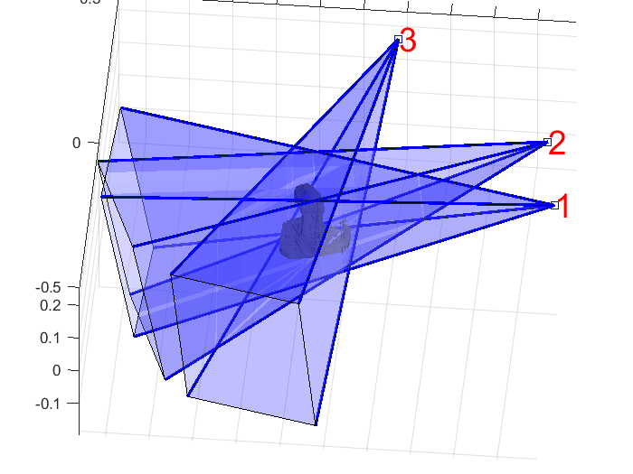
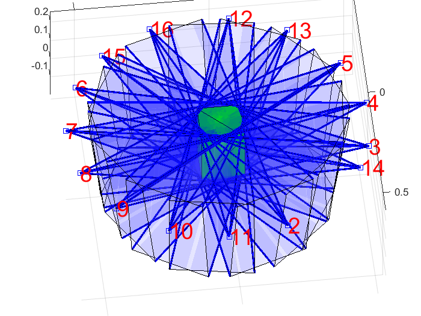

# Visual Hull Matlab

Visual Hull (VH) extraction from calibrate images using Matlab.
---
## Temple Sparse Ring
### VH after applying Marching Cube Algorithm


### Slices of VH at Z=1

### Slices of VH at Z=60

### Slices of VH at Z=90


### Camera Field of View(FOV)

### Intersection of all cameras FOV


## To run algorithm
```Matlab
main_visual_hull.m
```

---
## Datasets

https://vision.middlebury.edu/mview/data/

---

More details can be found at http://vision.gel.ulaval.ca/~visualhull/
